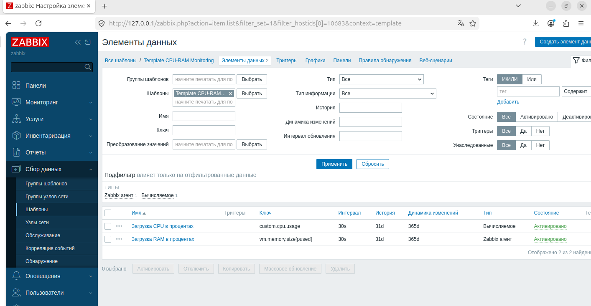
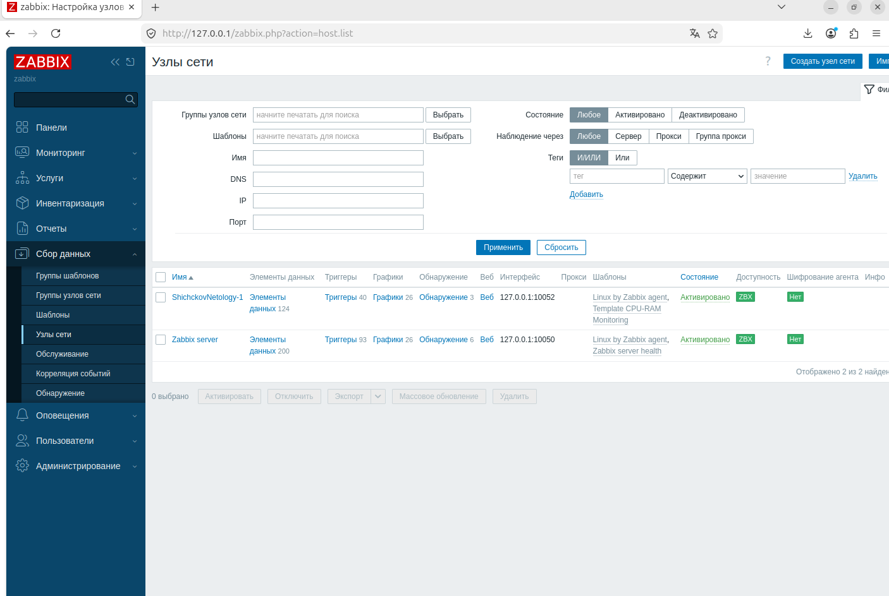

# Домашнее задание к занятию "`Домашнее задание к занятию «Zabbix`" - `Шичков Евгений`

### Инструкция по выполнению домашнего задания

   1. Сделайте `fork` данного репозитория к себе в Github и переименуйте его по названию или номеру занятия, например, https://github.com/имя-вашего-репозитория/git-hw или  https://github.com/имя-вашего-репозитория/7-1-ansible-hw).
   2. Выполните клонирование данного репозитория к себе на ПК с помощью команды `git clone`.
   3. Выполните домашнее задание и заполните у себя локально этот файл README.md:
      - впишите вверху название занятия и вашу фамилию и имя
      - в каждом задании добавьте решение в требуемом виде (текст/код/скриншоты/ссылка)
      - для корректного добавления скриншотов воспользуйтесь [инструкцией "Как вставить скриншот в шаблон с решением](https://github.com/netology-code/sys-pattern-homework/blob/main/screen-instruction.md)
      - при оформлении используйте возможности языка разметки md (коротко об этом можно посмотреть в [инструкции  по MarkDown](https://github.com/netology-code/sys-pattern-homework/blob/main/md-instruction.md))
   4. После завершения работы над домашним заданием сделайте коммит (`git commit -m "comment"`) и отправьте его на Github (`git push origin`);
   5. В личном кабинете прикрепите и отправьте ссылку на решение в виде md-файла в вашем Github.
   6. Любые вопросы по выполнению заданий спрашивайте в разделе “Вопросы по заданию” в личном кабинете.
   
Желаем успехов в выполнении домашнего задания!
   
### Дополнительные материалы, которые могут быть полезны для выполнения задания

1. [Руководство по оформлению Markdown файлов](https://gist.github.com/Jekins/2bf2d0638163f1294637#Code)

---

## Задание 1. Создание шаблона с мониторингом CPU и RAM

**Выполнено:**
- В веб-интерфейсе Zabbix создан шаблон `Template CPU-RAM Monitoring`.
- В шаблоне созданы два элемента данных (items):
  - **Загрузка CPU** – ключ `system.cpu.util[,idle]` (вычисляемый, формула `100 - last("system.cpu.util[,idle]")`).
  - **Загрузка RAM** – ключ `vm.memory.size[pused]`.
- Интервал опроса – 30 секунд.

**Скриншот страницы шаблона с элементами данных:**

---

## Задания 2–3. Добавление хостов и привязка шаблонов

**Выполнено:**
- В Zabbix добавлены два хоста:
  - `ShichckovNetology-1` (порт 10050, агент на той же ВМ)
  - `ShichckovNetology-2` (порт 10052, второй экземпляр агента)
- К каждому хосту привязаны шаблоны:
  - `Linux by Zabbix agent`
  - `Template CPU-RAM Monitoring` (созданный в задании 1)
- Оба хоста имеют зелёный статус (доступны).

**Скриншот страницы «Узлы сети» с двумя хостами и привязанными шаблонами:**

---

## Задание 4. Создание дашборда

**Выполнено:**
- В разделе «Панели управления» создана панель с именем `Моя первая панель`.
- Добавлены два виджета типа «График (классический)»:
  - График загрузки CPU для хоста `ShichckovNetology-1`.
  - График загрузки RAM для хоста `ShichckovNetology-2`.
- Виджеты расположены удобным образом.

**Скриншот готового дашборда:**

---
