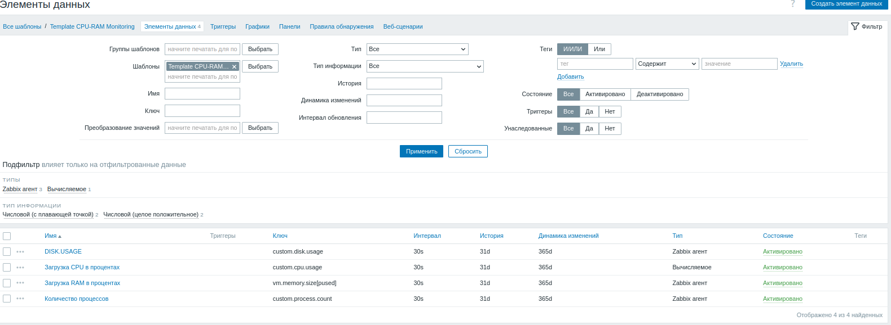
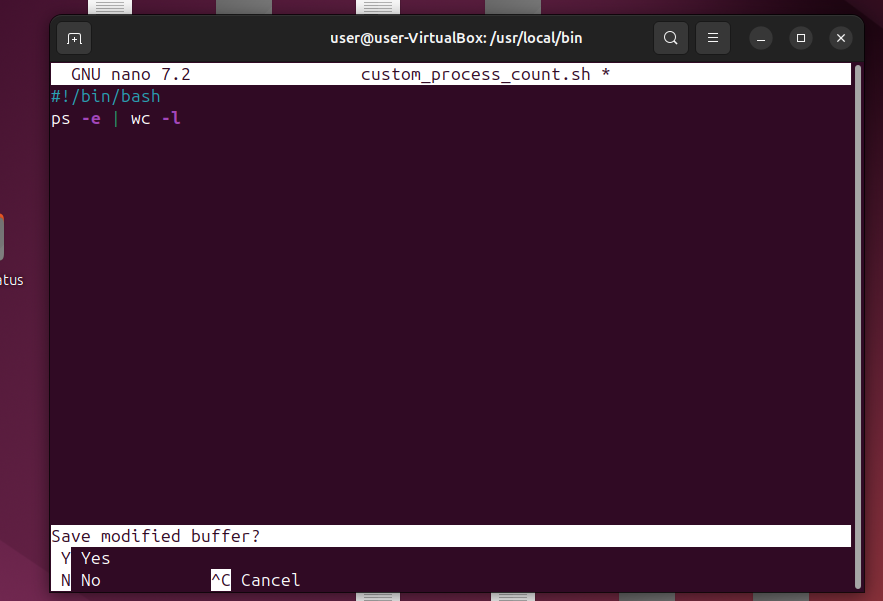
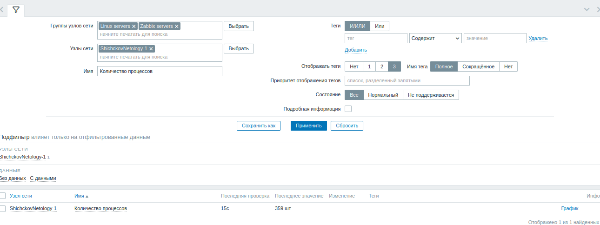
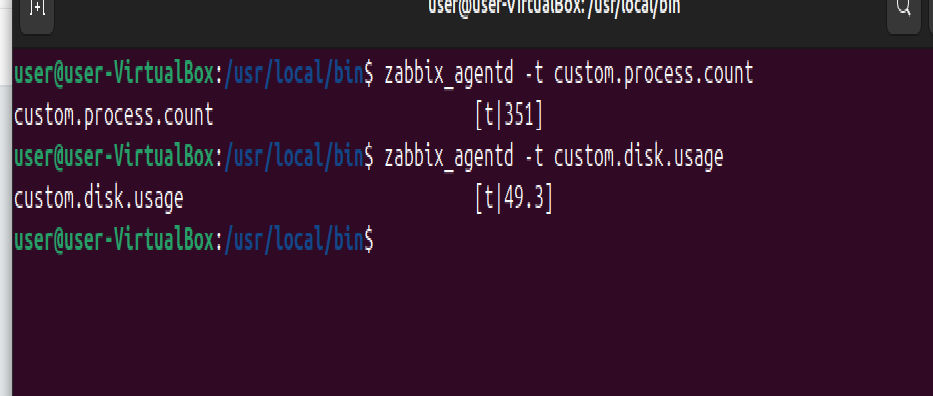
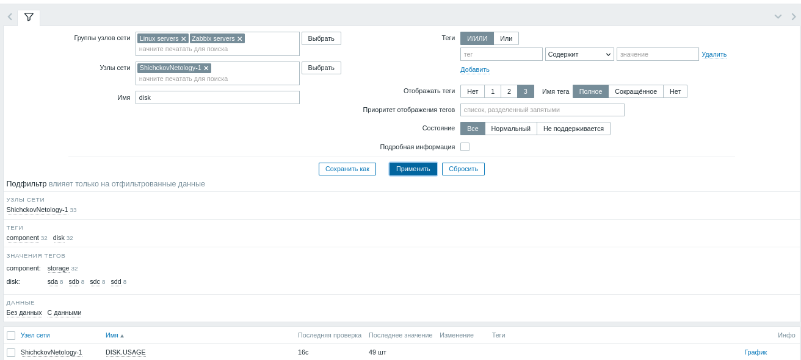
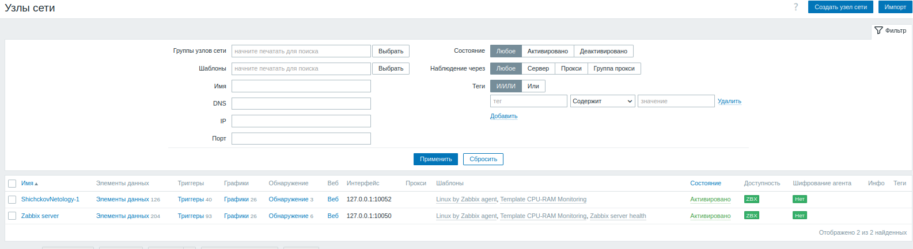
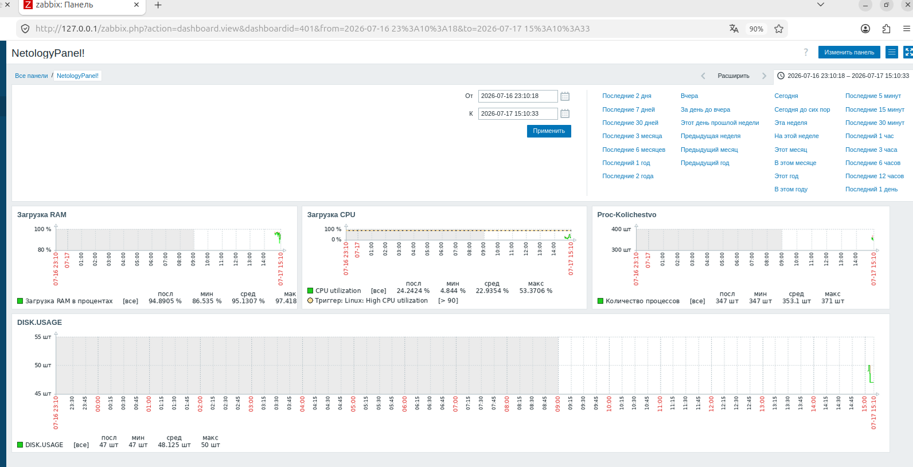
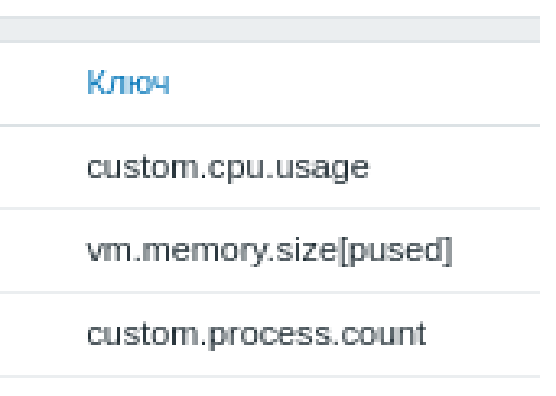
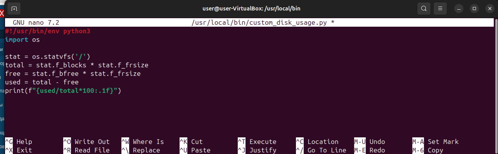

# Домашнее задание к занятию "`Домашнее задание к занятию «Zabbix`" - `Шичков Евгений`

### Инструкция по выполнению домашнего задания

   1. Сделайте `fork` данного репозитория к себе в Github и переименуйте его по названию или номеру занятия, например, https://github.com/имя-вашего-репозитория/git-hw или  https://github.com/имя-вашего-репозитория/7-1-ansible-hw).
   2. Выполните клонирование данного репозитория к себе на ПК с помощью команды `git clone`.
   3. Выполните домашнее задание и заполните у себя локально этот файл README.md:
      - впишите вверху название занятия и вашу фамилию и имя
      - в каждом задании добавьте решение в требуемом виде (текст/код/скриншоты/ссылка)
      - для корректного добавления скриншотов воспользуйтесь [инструкцией "Как вставить скриншот в шаблон с решением](https://github.com/netology-code/sys-pattern-homework/blob/main/screen-instruction.md)
      - при оформлении используйте возможности языка разметки md (коротко об этом можно посмотреть в [инструкции  по MarkDown](https://github.com/netology-code/sys-pattern-homework/blob/main/md-instruction.md))
   4. После завершения работы над домашним заданием сделайте коммит (`git commit -m "comment"`) и отправьте его на Github (`git push origin`);
   5. В личном кабинете прикрепите и отправьте ссылку на решение в виде md-файла в вашем Github.
   6. Любые вопросы по выполнению заданий спрашивайте в разделе “Вопросы по заданию” в личном кабинете.
   
Желаем успехов в выполнении домашнего задания!
   
### Дополнительные материалы, которые могут быть полезны для выполнения задания

1. [Руководство по оформлению Markdown файлов](https://gist.github.com/Jekins/2bf2d0638163f1294637#Code)

---

## Задание 1. Создание шаблона с мониторингом CPU и RAM (включая UserParameter)

**Выполнено:**
- Создан шаблон `Template CPU-RAM Monitoring` с элементами:
  - Загрузка CPU (UserParameter на Bash)
  - Загрузка RAM (встроенный ключ `vm.memory.size[pused]`)
  - Количество процессов (UserParameter на Bash)
  - Использование диска (UserParameter на Python)

**Скриншот элементов данных в шаблоне:**

**Результат работы Bash-скрипта (количество процессов):**

**Результат работы Python-скрипта (использование диска):**

---

## Задания 2–3. Добавление хостов и привязка шаблонов

Добавлены два хоста: `Zabbix server` и `ShichckovNetology-1`.  
К каждому привязаны шаблоны `Linux by Zabbix agent` и `Template CPU-RAM Monitoring`.  
Оба хоста имеют зелёный статус.

---

## Задание 4. Создание дашборда

Создана панель управления «NetologyPanel!» с графиками:
- Загрузка CPU (хост `ShichckovNetology-1`)
- Загрузка RAM (хост `ShichckovNetology-1`)
- Количество процессов (UserParameter)
- Использование диска (UserParameter)

---
## Дополнительные скриншоты.

